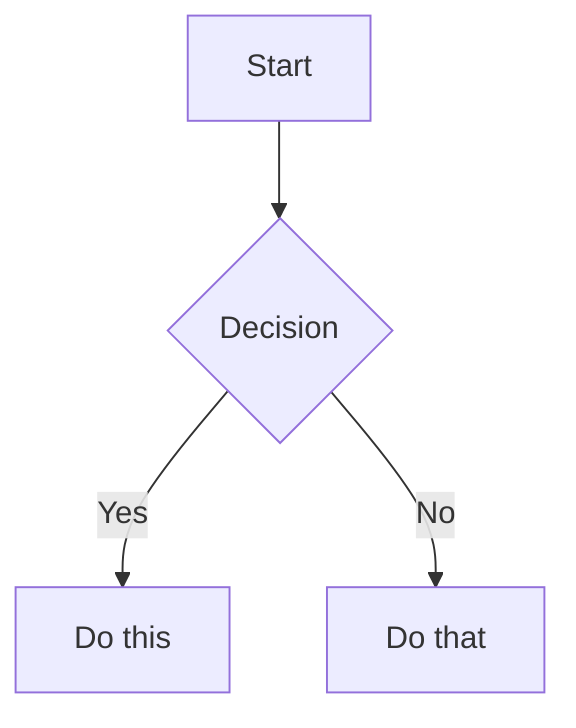

The `obsidian-markdown` skill teaches AI coding assistants to create and edit valid Obsidian Flavored Markdown. Obsidian extends CommonMark and GitHub Flavored Markdown with wikilinks, embeds, callouts, properties, comments, and other syntax. Load this skill when your agent is working with `.md` files inside an Obsidian vault, or whenever the user mentions wikilinks, callouts, frontmatter, tags, embeds, or Obsidian notes. Standard Markdown — headings, bold, italic, lists, blockquotes, code blocks, tables — is assumed knowledge; this skill covers only the Obsidian-specific extensions.

## Workflow

<Steps>
  <Step title="Add frontmatter">
    Add a YAML properties block at the very top of the file with `title`, `tags`, `aliases`, and any custom properties. See [/reference/properties](/reference/properties) for all property types.
  </Step>
  <Step title="Write content">
    Use standard Markdown for structure, then layer in Obsidian-specific syntax (wikilinks, callouts, embeds, etc.) as needed.
  </Step>
  <Step title="Link related notes">
    Use `[[wikilinks]]` for internal vault connections so Obsidian tracks renames automatically. Use `[text](url)` only for external URLs.
  </Step>
  <Step title="Embed content">
    Embed other notes, headings, images, or PDFs with the `![[embed]]` syntax. See [/reference/embeds](/reference/embeds) for all embed types.
  </Step>
  <Step title="Add callouts">
    Highlight important information using `> [!type]` callout syntax. See [/reference/callouts](/reference/callouts) for all callout types.
  </Step>
  <Step title="Verify">
    Confirm the note renders correctly in Obsidian's reading view before finishing.
  </Step>
</Steps>

## Internal Links (Wikilinks)

Wikilinks are the primary way to connect notes inside a vault. Obsidian automatically updates them when a note is renamed.

```markdown
[[Note Name]]                          Link to note
[[Note Name|Display Text]]             Custom display text
[[Note Name#Heading]]                  Link to heading
[[Note Name#^block-id]]                Link to block
[[#Heading in same note]]              Same-note heading link
```

Define a block ID by appending `^block-id` to any paragraph:

```markdown
This paragraph can be linked to. ^my-block-id
```

For lists and blockquotes, place the block ID on a separate line after the block:

```markdown
> A quote block

^quote-id
```

<Tip>
  Use `[[wikilinks]]` for notes within the vault — Obsidian tracks renames automatically. Use `[text](url)` for external URLs only.
</Tip>

## Embeds

Prefix any wikilink with `!` to embed its content inline in the current note.

```markdown
![[Note Name]]                         Embed full note
![[Note Name#Heading]]                 Embed section
![[image.png]]                         Embed image
![[image.png|300]]                     Embed image with width
![[document.pdf#page=3]]               Embed PDF page
```

See [/reference/embeds](/reference/embeds) for audio, video, search embeds, and external images.

## Callouts

Callouts render highlighted blocks of information with a colored icon and title. They are based on blockquote syntax.

```markdown
> [!note]
> Basic callout.

> [!warning] Custom Title
> Callout with a custom title.

> [!faq]- Collapsed by default
> Foldable callout (- collapsed, + expanded).
```

Common callout types: `note`, `tip`, `warning`, `info`, `example`, `quote`, `bug`, `danger`, `success`, `failure`, `question`, `abstract`, `todo`.

See [/reference/callouts](/reference/callouts) for the full list with aliases, nesting, and custom CSS callouts.

## Properties (Frontmatter)

Properties are defined in a YAML block enclosed by `---` at the top of the file. Obsidian renders them in a structured properties panel in editing view.

```yaml
---
title: My Note
date: 2024-01-15
tags:
  - project
  - active
aliases:
  - Alternative Name
cssclasses:
  - custom-class
---
```

Default properties: `tags` (searchable labels), `aliases` (alternative note names for link suggestions), `cssclasses` (CSS classes applied to the note for styling).

See [/reference/properties](/reference/properties) for all property types, tag syntax rules, and advanced usage.

## Tags

Tags can appear inline anywhere in the note body, or in the `tags` property in frontmatter.

```markdown
#tag                    Inline tag
#nested/tag             Nested tag with hierarchy
```

Tags can contain letters, numbers (not as the first character), underscores, hyphens, and forward slashes. Spaces are not allowed — use hyphens or underscores as separators.

## Comments

Obsidian supports hidden comments that are visible in edit mode but invisible in reading view.

```markdown
This is visible %%but this is hidden%% text.

%%
This entire block is hidden in reading view.
%%
```

## Formatting & Math

Obsidian extends standard Markdown with highlight syntax and LaTeX math rendering.

```markdown
==Highlighted text==                   Highlight syntax

Inline: $e^{i\pi} + 1 = 0$

Block:
$$
\frac{a}{b} = c
$$
```

## Footnotes

```markdown
Text with a footnote[^1].

[^1]: Footnote content.

Inline footnote.^[This is inline.]
```

## Diagrams (Mermaid)

Obsidian renders Mermaid diagrams natively inside fenced code blocks tagged `mermaid`.

````markdown

````

<Note>
  To link Mermaid nodes to Obsidian notes, add `class NodeName internal-link;` inside the diagram definition.
</Note>

## Complete Example

The following note demonstrates frontmatter properties, wikilinks, a callout, task lists, inline math, an image embed, and a section link — all in a single file.

````markdown
---
title: Project Alpha
date: 2024-01-15
tags:
  - project
  - active
status: in-progress
---

# Project Alpha

This project aims to [[improve workflow]] using modern techniques.

> [!important] Key Deadline
> The first milestone is due on ==January 30th==.

## Tasks

- [x] Initial planning
- [ ] Development phase
  - [ ] Backend implementation
  - [ ] Frontend design

## Notes

The algorithm uses $O(n \log n)$ sorting. See [[Algorithm Notes#Sorting]] for details.

![[Architecture Diagram.png|600]]

Reviewed in [[Meeting Notes 2024-01-10#Decisions]].
````
